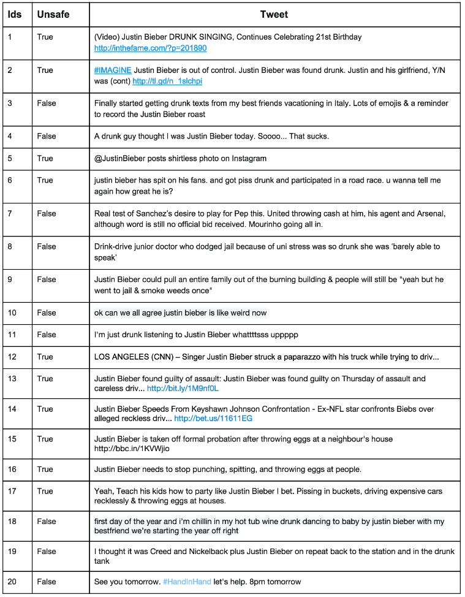
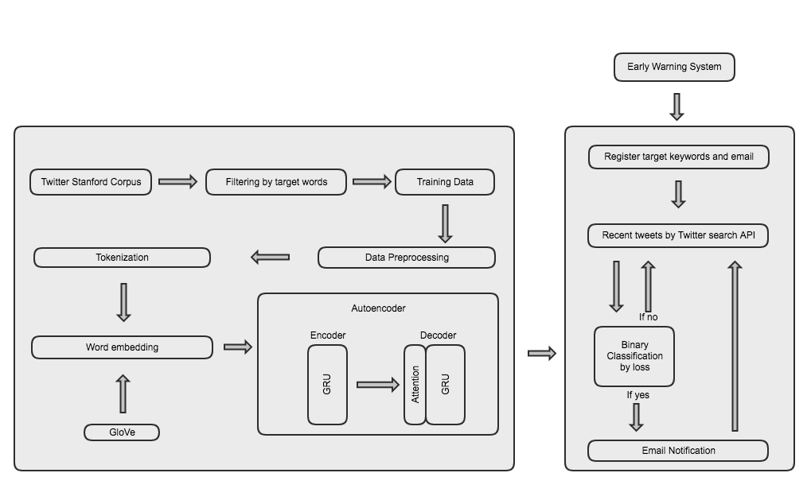

# Early Warning System based on Twitter

##  1  Introduction

As people are getting involved in Social Network Services such as Twitter, we can come up with a bunch of ideas about how to use that data to make the useful application. A year ago, I’ve seen that one of Googler created trump2cash[1] which the author buys the stock based on trump's feeling with sentiment analysis on his twitter feed.

While I was looking for a project which is similar to trump2cash, fortunately, I got a interesting coding challenge from Gumgum Inc., and it’s related to machine learning and natural language processing. The challenge is to build an an early warning system based on Twitter feed that would alert me when the Bieber is in trouble like whether it’s for drunk driving or objectionable videos. to better understand, see the picture below.

##  2  Approach(My thought process)

I was thinking about what kinds of labeled dataset I might be able to use to implement this binary classification. This is because the supervised learning make usually better outcome than unsupervised learning. However, I couldn’t find the right dataset for this problem. The most similar one is Twitter dataset for sentiment analysis, but this is not that perfectly matched with this problem even though they have relationship with each other. I guess there would be many neutral or positive tweets which are indicating Bieber’s trouble such as "Justin Bieber DRUNK SINGING, Continues Celebrating 21st Birthday”.

After that I was thinking about labeling twitter data manually and do supervised learning with any well known algorithm. However, considering the given 14 days for this challenge, that period was not enough to spend time to labeling manually(Even, I had to do a bunch of class HWs) Finally, I gave up doing supervised learning for this challenge and then tried to come up with unsupervised learning or semi-supervised learning which don’t need labels.

I was pondering for a long time as I was lying down on my bed at night, and I thought I have to basically make a news aggregator. Then, I need to find a bunch of posts about the same topic and filter those topics to the ones I want. I came up with clustering algorithms such as K mean Clustering. Similarly, I got another idea which use anomaly detection to find out normal input, and I decided to use this idea to solve this problem.

First of all, I am going to collect a bunch of vocabulary list that is related to celebrities’ trouble such as drunk driving, guilty, or drug.
Second, I am going to filter the tweets that don’t include any vocabulary of the list based on the twitter sentiment dataset. What I get from the filtered dataset would have the same domain in terms of troubles. In other words, the train set would be only composed of anomalies. Third, my strategy is to build auto-encoder with this train set. If I put normal tweets that aren't related to troubles, the loss of the model would get high. Otherwise, the loss would get close to 0. If the loss is close to 0, I will consider that this tweet might talk about troubles. Thus, if a tweet make the loss low and a tweet include the target word such as “Justin Bieber”, I will notify this tweet through email.

## 3 Application Pipeline

##  3 Datasets

One of the major challenges in Sentiment Analysis of Twitter is to collect a
labelled dataset. Researchers have made public the following datasets for
training and testing classifiers.

##  4 Preprocessing

User-generated content on the web is seldom present in a form usable for
learning. It becomes important to normalize the text by applying a series of
pre-processing steps. We have applied an extensive set of pre-processing steps
to decrease the size of the feature set to make it suitable for learning
algorithms.

###  4.1  Hashtags

A hashtag is a word or an un-spaced phrase prefixed with the hash symbol (#).
These are used to both naming subjects and phrases that are currently in
trending topics. For example, #iPad, #news

Regular Expression: `#(\w+)`

Replace Expression: `HASH_\1`

###  4.2  Handles

Every Twitter user has a unique username. Any thing directed towards that user
can be indicated be writing their username preceded by ‘@’. Thus, these are
like proper nouns. For example, @Apple

Regular Expression: `@(\w+)`

Replace Expression: `HNDL_\1`

###  4.3  URLs

Users often share hyperlinks in their tweets. Twitter shortens them using its
in-house URL shortening service, like http://t.co/FCWXoUd8 - such links also
enables Twitter to alert users if the link leads out of its domain. From the
point of view of text classification, a particular URL is not important.
However, presence of a URL can be an important feature. Regular expression for
detecting a URL is fairly complex because of different types of URLs that can
be there, but because of Twitter’s shortening service, we can use a relatively
simple regular expression.

Regular Expression: `(http|https|ftp)://[a-zA-Z0-9\\./]+`

Replace Expression: `URL`

###  4.4  Emoticons

Use of emoticons is very prevalent throughout the web, more so on micro-
blogging sites. We identify the following emoticons and replace them with a
single word. Table 4 lists the emoticons we are currently detecting. All other
emoticons would be ignored.

<table border="1">
<tr><td colspan="1" align="center">Emoticons </td><td colspan="6" align="center">Examples </td></tr>
<tr><td align="left"><tt>EMOT_SMILEY</tt>   </td><td align="left"><tt>:-)</tt>  </td><td align="left"><tt>:)</tt>   </td><td align="left"><tt>(:</tt>   </td><td align="left"><tt>(-:</tt>  </td><td align="left"><tt></tt>     </td><td align="left"><tt></tt> </td></tr>
<tr><td align="left"><tt>EMOT_LAUGH</tt>    </td><td align="left"><tt>:-D</tt>  </td><td align="left"><tt>:D</tt>   </td><td align="left"><tt>X-D</tt>  </td><td align="left"><tt>XD</tt>   </td><td align="left"><tt>xD</tt>   </td><td align="left"><tt></tt> </td></tr>
<tr><td align="left"><tt>EMOT_LOVE</tt>     </td><td align="left"><tt>&lt;3</tt>    </td><td align="left"><tt>:*</tt>   </td><td align="left"><tt></tt>     </td><td align="left"><tt></tt>     </td><td align="left"><tt></tt>     </td><td align="left"><tt></tt> </td></tr>
<tr><td align="left"><tt>EMOT_WINK</tt>     </td><td align="left"><tt>;-)</tt>  </td><td align="left"><tt>;)</tt>   </td><td align="left"><tt>;-D</tt>  </td><td align="left"><tt>;D</tt>   </td><td align="left"><tt>(;</tt>   </td><td align="left"><tt>(-;</tt> </td></tr>
<tr><td align="left"><tt>EMOT_FROWN</tt>    </td><td align="left"><tt>:-(</tt>  </td><td align="left"><tt>:(</tt>   </td><td align="left"><tt>(:</tt>   </td><td align="left"><tt>(-:</tt>  </td><td align="left"><tt></tt>     </td><td align="left"><tt></tt> </td></tr>
<tr><td align="left"><tt>EMOT_CRY</tt>  </td><td align="left"><tt>:,(</tt>  </td><td align="left"><tt>:'(</tt>  </td><td align="left"><tt>:"(</tt>  </td><td align="left"><tt>:((</tt>  </td><td align="left"><tt></tt>     </td><td align="left"><tt></tt> </td></tr></table>

Table 4: List of Emoticons

### 4.5  Punctuations

Although not all Punctuations are important from the point of view of
classification but some of these, like question mark, exclamation mark can
also provide information about the sentiments of the text. We replace every
word boundary by a list of relevant punctuations present at that point. Table
5 lists the punctuations currently identified. We also remove any single
quotes that might exist in the text.

<table border="1">
<tr><td colspan="1" align="center">Punctuations </td><td colspan="2" align="center">Examples </td></tr>
<tr><td align="left"><tt>PUNC_DOT</tt> </td><td align="left"><tt>.</tt> </td><td align="left"><tt></tt> </td></tr>
<tr><td align="left"><tt>PUNC_EXCL</tt> </td><td align="left"><tt>!</tt> </td><td align="left"><tt>¡</tt> </td></tr>
<tr><td align="left"><tt>PUNC_QUES</tt> </td><td align="left"><tt>?</tt> </td><td align="left"><tt>¿</tt> </td></tr>
<tr><td align="left"><tt>PUNC_ELLP</tt> </td><td align="left"><tt>...</tt> </td><td align="left"><tt>…</tt> </td></tr></table>

Table 5: List of Punctuations

### 4.6  Repeating Characters

People often use repeating characters while using colloquial language, like
"I’m in a hurrryyyyy", "We won, yaaayyyyy!" As our final pre-processing step,
we replace characters repeating more than twice as two characters.

Regular Expression: `(.)\1{1,}`

Replace Expression: `\1\1`

## 5 How to run

##  6  Experimentation

We train 90% of our data using different combinations of features and test
them on the remaining 10%. We take the features in the following combinations
- only unigrams, unigrams + filtered bigrams and trigrams, unigrams +
negation, unigrams + filtered bigrams and trigrams + negation. We then train
classifiers using different classification algorithms - Naive Bayes Classifier
and Maximum Entropy Classifier.

##  7  Future Work

filtering the by more specific phrases

**Stemming Algorithms**
     bb

** N-gram**
    bb

##  8  Conclusion

We create a sentiment classifier for twitter using labelled
data sets. We also investigate the relevance of using a double step classifier
and negation detection for the purpose of sentiment analysis.

Our baseline classifier that uses just the unigrams achieves an accuracy of
around 80.00%. Accuracy of the classifier increases if we use negation
detection or introduce bigrams and trigrams. Thus we can conclude that both
Negation Detection and higher order n-grams are useful for the purpose of text
classification. However, if we use both n-grams and negation detection, the
accuracy falls marginally. We also note that Single step classifiers out
perform double step classifiers. In general, Naive Bayes Classifier performs
better than Maximum Entropy Classifier.

We achieve the best accuracy of 86.68% in the case of Unigrams + Bigrams +
Trigrams, trained on Naive Bayes Classifier.

## References

[1] Max, B. (2017, Feb 6) This Machine Turns Trump Tweets into Planned Parenthood Donations. Retrieved from https://medium.com/@maxbraun/this-machine-turns-trump-tweets-into-planned-parenthood-donations-4ece8301e722
