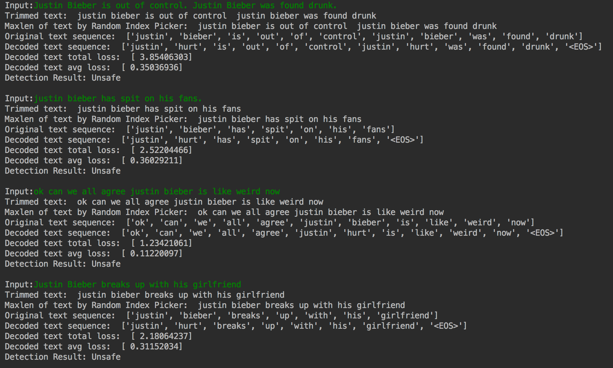
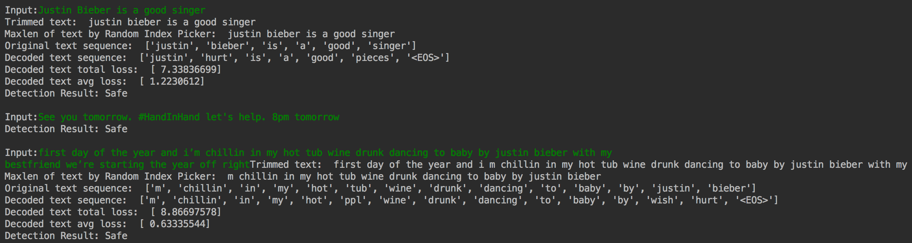

# Early Warning System based on Twitter

##  1  Introduction

As people are getting involved in Social Networking Services such as Twitter, we can come up with a bunch of ideas about how to use that data to make useful applications. A year ago, I saw a Googler had created trump2cash[1] which the author buys stock based on Trump's feelings using sentiment analysis on his Twitter feed.


While I was looking for a project which is similar to trump2cash, I got an interesting coding challenge from Gumgum Inc. related to machine learning and natural language processing. The challenge is to build an early warning system based on Twitter feed that would alert me when Justin Bieber is in trouble like drunk driving or objectionable videos. To better understand, see the picture below.


## 2 How to run

### 2.1 Prerequisites

This project is based on Python 3.5

```
pip install -r requirement.txt
```

Stanford Twitter Corpus: `http://cs.stanford.edu/people/alecmgo/trainingandtestdata.zip`

GloVe pre-trained vector: `https://nlp.stanford.edu/projects/glove/`

### 2.2 How to train

#### Training from the beginning
```shell
$python train.py
```

#### Training with loaded model
```shell
$python train.py encoder_model decoder_model
```

### 2.3 testing classification
```shell
$python classifier.py
.
.
.
Input:Justin Bieber is a good singer
Trimmed text:  justin bieber is a good singer
Maxlen of text by Random Index Picker:  justin bieber is a good singer
Original text sequence:  ['justin', 'bieber', 'is', 'a', 'good', 'singer']
Decoded text sequence:  ['justin', 'hurt', 'is', 'a', 'good', 'pieces', '<EOS>']
Decoded text total loss:  [ 7.29614544]
Decoded text avg loss:  [ 1.21602428]
Detection Result: Safe

Input:
```

### 2.4 How to run the application

```shell
$python early_warning_alarm.py --keyword 'Justin Bieber' --sender_email put_your_email --sender_pwd put_your_pwd --recipient_email put_recipient_email
```


##  3  Approach(My thought process)

I was thinking about what kinds of labeled dataset I might be able to use to implement this binary classification. This is because the supervised learning usually has a better outcome than unsupervised learning. However, I couldn’t find the right dataset for this problem. The most similar one is Twitter dataset for sentiment analysis, but this is not that perfectly matched with this problem. I guess there would be many neutral or positive tweets which are indicating Bieber’s trouble such as "Justin Bieber DRUNK SINGING, Continues Celebrating 21st Birthday”.

After that I was thinking about labeling Twitter data manually and do supervised learning with any well known algorithm. However, considering the given 14 days for this challenge, that period was not enough to spend time to label manually (I still had to do a bunch of class HWs) Finally, I gave up doing supervised learning for this challenge and then tried to come up with an unsupervised learning or semi-supervised learning strategy which doesn’t need labels.

I was pondering for a long time as I was lying down on my bed at night, and I thought I have to basically make a news aggregator. Then, I need to find a bunch of posts about the same topic and filter those topics to the ones I want. I came up with clustering algorithms such as K mean Clustering. Similarly, I got another idea which use anomaly detection to find out normal input, and I decided to use this idea to solve this problem.

First of all, I collect a bunch of vocabulary list that is related to celebrities’ trouble such as drunk driving, guilty, or drug.
Next, I filter the tweets that don’t include any vocabulary on the list based on the twitter sentiment dataset. What I get from the filtered dataset would have the same domain in terms of troubles. In other words, the train set would be only composed of anomalies. Third, my strategy is to build auto-encoder with this train set. If I put normal tweets that aren't related to troubles, the loss of the model would be too high. Otherwise, the loss would be close to 0. If the loss is close to 0, I will consider that this tweet might talk about troubles. Thus, if a tweet makes the loss low and it includes the target word such as “Justin Bieber”, I will notify this tweet through email.

##  4  Application Pipeline


##  5  Preprocessing

User-generated content on the web is seldom present in a form usable for
learning. It becomes important to normalize the text by applying a series of
pre-processing steps. I have applied an extensive set of pre-processing steps
to decrease the size of the feature set to make it suitable for learning
algorithms.

###  5.1  Hashtags

A hashtag is a word or an un-spaced phrase prefixed with the hash symbol (#).
These are used to both naming subjects and phrases that are currently in
trending topics. For example, #iPad, #news

Regular Expression: `#(\w+)`

Replace Expression: `HASH_\1`

###  5.2  Handles

Every Twitter user has a unique username. Any thing directed towards that user
can be indicated be writing their username preceded by ‘@’. Thus, these are
like proper nouns. For example, @Apple

Regular Expression: `@(\w+)`

Replace Expression: `HNDL_\1`

###  5.3  URLs

Users often share hyperlinks in their tweets. Twitter shortens them using its
in-house URL shortening service, like http://t.co/FCWXoUd8 - such links also
enables Twitter to alert users if the link leads out of its domain. From the
point of view of text classification, a particular URL is not important.
However, presence of a URL can be an important feature. Regular expression for
detecting a URL is fairly complex because of different types of URLs that can
be there, but because of Twitter’s shortening service, I can use a relatively
simple regular expression.

Regular Expression: `(http|https|ftp)://[a-zA-Z0-9\\./]+`

Replace Expression: `URL`

###  5.4  Emoticons

Use of emoticons is very prevalent throughout the web, more so on micro-
blogging sites. We identify the following emoticons and replace them with a
single word. Below lists the emoticons I am currently detecting. All other
emoticons would be ignored.

<div style="text-align:center">
<table border="1">
<tr><td colspan="1" align="center">Emoticons </td><td colspan="6" align="center">Examples </td></tr>
<tr><td align="left"><tt>EMOT_SMILEY</tt>   </td><td align="left"><tt>:-)</tt>  </td><td align="left"><tt>:)</tt>   </td><td align="left"><tt>(:</tt>   </td><td align="left"><tt>(-:</tt>  </td><td align="left"><tt></tt>     </td><td align="left"><tt></tt> </td></tr>
<tr><td align="left"><tt>EMOT_LAUGH</tt>    </td><td align="left"><tt>:-D</tt>  </td><td align="left"><tt>:D</tt>   </td><td align="left"><tt>X-D</tt>  </td><td align="left"><tt>XD</tt>   </td><td align="left"><tt>xD</tt>   </td><td align="left"><tt></tt> </td></tr>
<tr><td align="left"><tt>EMOT_LOVE</tt>     </td><td align="left"><tt>&lt;3</tt>    </td><td align="left"><tt>:*</tt>   </td><td align="left"><tt></tt>     </td><td align="left"><tt></tt>     </td><td align="left"><tt></tt>     </td><td align="left"><tt></tt> </td></tr>
<tr><td align="left"><tt>EMOT_WINK</tt>     </td><td align="left"><tt>;-)</tt>  </td><td align="left"><tt>;)</tt>   </td><td align="left"><tt>;-D</tt>  </td><td align="left"><tt>;D</tt>   </td><td align="left"><tt>(;</tt>   </td><td align="left"><tt>(-;</tt> </td></tr>
<tr><td align="left"><tt>EMOT_FROWN</tt>    </td><td align="left"><tt>:-(</tt>  </td><td align="left"><tt>:(</tt>   </td><td align="left"><tt>(:</tt>   </td><td align="left"><tt>(-:</tt>  </td><td align="left"><tt></tt>     </td><td align="left"><tt></tt> </td></tr>
<tr><td align="left"><tt>EMOT_CRY</tt>  </td><td align="left"><tt>:,(</tt>  </td><td align="left"><tt>:'(</tt>  </td><td align="left"><tt>:"(</tt>  </td><td align="left"><tt>:((</tt>  </td><td align="left"><tt></tt>     </td><td align="left"><tt></tt> </td></tr></table>

<a id="tab:emot">
</a>
</div>

### 5.5  Punctuations

Although not all Punctuations are important from the point of view of
classification but some of these, like question mark, exclamation mark can
also provide information about the sentiments of the text. We replace every
word boundary by a list of relevant punctuations present at that point. Below lists the punctuations currently identified. We also remove any single
quotes that might exist in the text.

<div style="text-align:center">
<table border="1">
<tr><td colspan="1" align="center">Punctuations </td><td colspan="2" align="center">Examples </td></tr>
<tr><td align="left"><tt>PUNC_DOT</tt> </td><td align="left"><tt>.</tt> </td><td align="left"><tt></tt> </td></tr>
<tr><td align="left"><tt>PUNC_EXCL</tt> </td><td align="left"><tt>!</tt> </td><td align="left"><tt>¡</tt> </td></tr>
<tr><td align="left"><tt>PUNC_QUES</tt> </td><td align="left"><tt>?</tt> </td><td align="left"><tt>¿</tt> </td></tr>
<tr><td align="left"><tt>PUNC_ELLP</tt> </td><td align="left"><tt>...</tt> </td><td align="left"><tt>…</tt> </td></tr></table>


<a id="tab:punc">
</a>
</div>

### 5.6  Repeating Characters

People often use repeating characters while using colloquial language, like
"I’m in a hurrryyyyy", "We won, yaaayyyyy!" As our final pre-processing step,
I replace characters repeating more than twice as two characters.

Regular Expression: `(.)\1{1,}`

Replace Expression: `\1\1`

## 6 Model

### 6.1 Auto Encoder

|                         |               |
| ----------------------- |:-------------:|
| Encoder                 | GRU           |
| Number of Encoder Layer | 1             |
| Decoder                 | GRU+Attention |
| Number of Encoder Layer | 1             |


### 6.2 Hyperparameters and train information

|                          |                             |
| ------------------------ |:---------------------------:|
| Min Length               |  3                          |
| Max Length               | 15                          |
| Pre-trained Model        | GloVe                       |
| Teacher forcing ratio    | 0.5                         |
| Maximum Norm             | 2.0                         |
| Word Embedding Dimension | 200                         |
| Loss function            | Negative Log likelihood     |
| Optimizer                | Stochastic Gradient Descent |

### 6.3 Train Environment
|                          |                             |
| ------------------------ |:---------------------------:|
| Training time            | About 48 hours(172,438 sec)|
| Machine                  | MacBook Pro Processor 2GHz Intel Core i7 |
| Memory                   | 8 GB 1600 MHz DDR3                       |
| Graphics                 | Intel Iris Pro 1536 MB                   |


##  7  Experimentation

The average loss of this model is approximately 0.5~ 0.6.
That means, as long as I put the text which is in the same domain as the model, the loss would be about 0.5 or less.
That's why I put the threshold at 0.5. If the loss is less than 0.5, I consider the tweet as an unsafe tweet.

### unsafe tweets


### safe tweets



##  8  Future Work

Due to time and resources, I couldn't try several more ideas.
If I have more data, I can filter the data with more specific words or phrases.
In addition, I can also try to apply stemming algorithms or n-gram model if I have a better machine to train.
With the dependency parser and pos tagger, I would be able to get the subject of the sentence.
If Justin Bieber is not the subject of the given sentence, I can skip the sentence or decrease weight of the sentence for the classification.


##  9  Conclusion

I created an early warning system for Twitter data sets, and my auto-encoder works very well by showing that if I put the sentence which is in the same domain with this model, I can get almost the same sentence.
For the given tweet samples from Gumgum, my classifier achieved an accuracy of around 60% with adjusted threshold.
However, due to the training time, I just trained 2 epoch of the train set.
If I train for more epochs and have more features by adding n-gram, stemming or synonym checking, the accuracy would be greatly improved.
I really enjoyed this challenge and want to thank your team for this awesome challenge.


## References

[1] Max, B. (2017, Feb 6) This Machine Turns Trump Tweets into Planned Parenthood Donations. Retrieved from https://medium.com/@maxbraun/this-machine-turns-trump-tweets-into-planned-parenthood-donations-4ece8301e722
